<div align="center">

# DriveFlow

### Plataforma moderna e inteligente para gestão e aluguel de veículos

**Documentação de Projeto | Versão 1.1 | Projeto de Software**

<br>


<br>

<b>Sistema modelado para conectar clientes e administradores de frotas, permitindo a reserva ágil de automóveis, vistorias operacionais de balcão, controle de pagamentos e análise de faturamento.</b>

</div>

---

<div align="center">

## Documento Completo Oficial

<b>Este é o documento principal do projeto DriveFlow.</b>

O arquivo completo em PDF contém a documentação final do sistema, com a estrutura acadêmica solicitada, descrição do domínio, requisitos, contratos, modelos UML, arquitetura e modelos de dados.

<br>

<a href="DriveFlow.pdf">
  
</a>

<br><br>

📄 **Arquivo:** [`DriveFlow.pdf`](DriveFlow.pdf)

</div>

> **Importante:** o PDF acima é a versão completa e oficial da documentação do projeto. O restante deste README funciona como apresentação visual, resumo navegável e apoio aos códigos estruturados em PlantUML.

---

## Cartão do Projeto

| Item | Informação |
| --- | --- |
| **Nome do sistema** | [cite_start]DriveFlow [cite: 41] |
| **Versão** | [cite_start]1.0 [cite: 42] |
| **Disciplina** | [cite_start]Projeto de Software [cite: 43] |
| **Elaborado por** | [cite_start]João Pedro Moura Santos [cite: 43] |
| **Data de criação** | [cite_start]05/06/2026 [cite: 44] |
| **Tipo de entrega** | [cite_start]Projeto, arquitetura e diagramação [cite: 47] |
| **Ferramenta obrigatória** | PlantUML |
| **Implementação de código** | [cite_start]Escopo conceitual de engenharia de software [cite: 47] |

> [cite_start]Este repositório documenta o projeto de um sistema completo, com foco em análise, arquitetura, diagramas UML, regras de negócio, contratos de operação e modelo de dados[cite: 47].

---

## Visão Rápida

<table>
  <tr>
    <td width="33%">
      <b>Problema</b><br>
      Locadoras de veículos necessitam de controle centralizado de frota, redução de erros em vistorias de retirada/devolução e previsibilidade financeira de reservas.
    </td>
    <td width="33%">
      <b>Solução</b><br>
      Uma plataforma web integrada que unifica a reserva pelo cliente, o controle de balcão (check-out/check-in) pelo administrador e o faturamento automático.
    </td>
    <td width="33%">
      <b>Resultado esperado</b><br>
      Locações de automóveis rastreáveis, seguras, com vistorias documentadas e indicadores consolidados de ocupação da frota.
    </td>
  </tr>
</table>

---

## Tabela de Conteúdo

0. [Documento Completo Oficial](#documento-completo-oficial)
1. [Introdução](#1-introdução)
2. [Modelos de Usuário e Requisitos](#2-modelos-de-usuário-e-requisitos)
   - [2.1 Descrição de Atores](#21-descrição-de-atores)
   - [2.2 Modelo de Casos de Uso](#22-modelo-de-casos-de-uso)
   - [2.3 Diagrama de Sequência do Sistema e Contratos de Operação](#23-diagrama-de-sequência-do-sistema-e-contratos-de-operação)
3. [Modelos de Projeto](#3-modelos-de-projeto)
   - [3.1 Arquitetura](#31-arquitetura)
   - [3.2 Diagrama de Componentes e Implantação](#32-diagrama-de-componentes-e-implantação)
   - [3.3 Diagrama de Classes](#33-diagrama-de-classes)
   - [3.4 Diagramas de Sequência de Projeto](#34-diagramas-de-sequência-de-projeto)
   - [3.5 Diagramas de Comunicação](#35-diagramas-de-comunicação)
   - [3.6 Diagramas de Estados](#36-diagramas-de-estados)
4. [Modelos de Dados](#4-modelos-de-dados)
5. [Referências](#referências)

---

## Galeria de Diagramas

<table>
  <tr>
    <td align="center" width="33%">
      <b>Casos de Uso</b><br>
      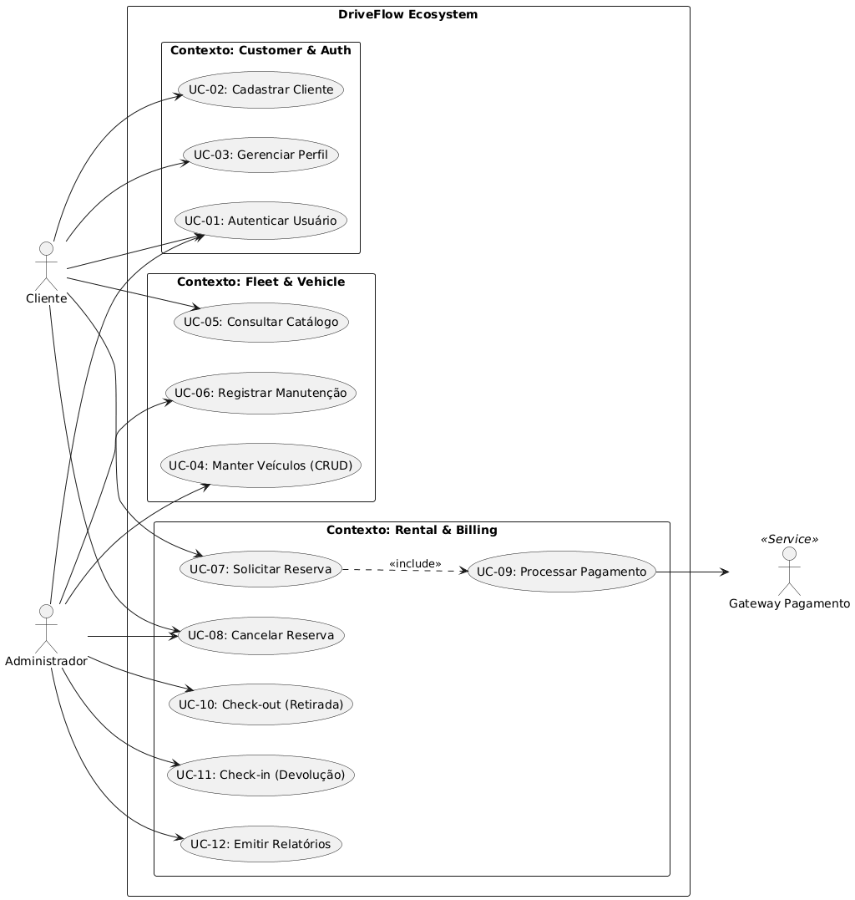
    </td>
    <td align="center" width="33%">
      <b>Sequência do Sistema</b><br>
      
    </td>
    <td align="center" width="33%">
      <b>Arquitetura</b><br>
      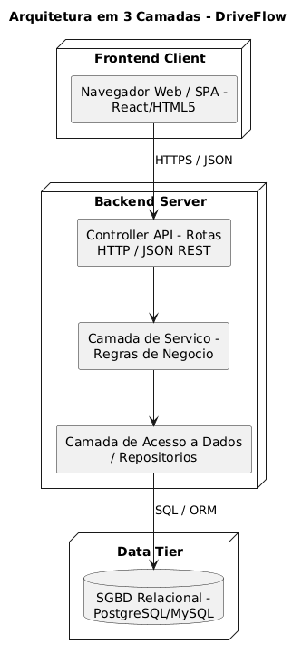
    </td>
  </tr>
  <tr>
    <td align="center" width="33%">
      <b>Implantação</b><br>
      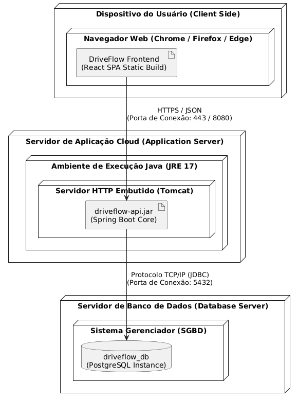
    </td>
    <td align="center" width="33%">
      <b>Classes</b><br>
      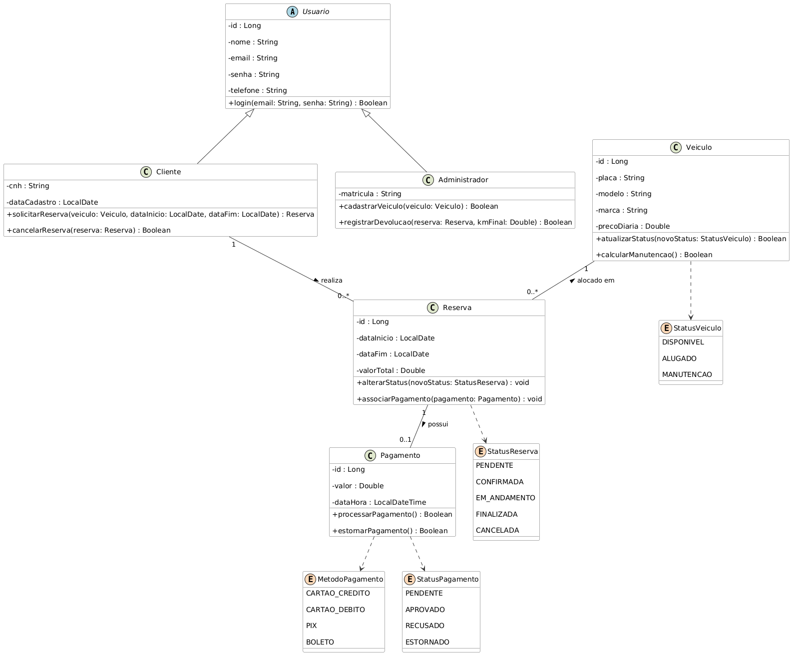
    </td>
    <td align="center" width="33%">
      <b>Sequência de Projeto</b><br>
      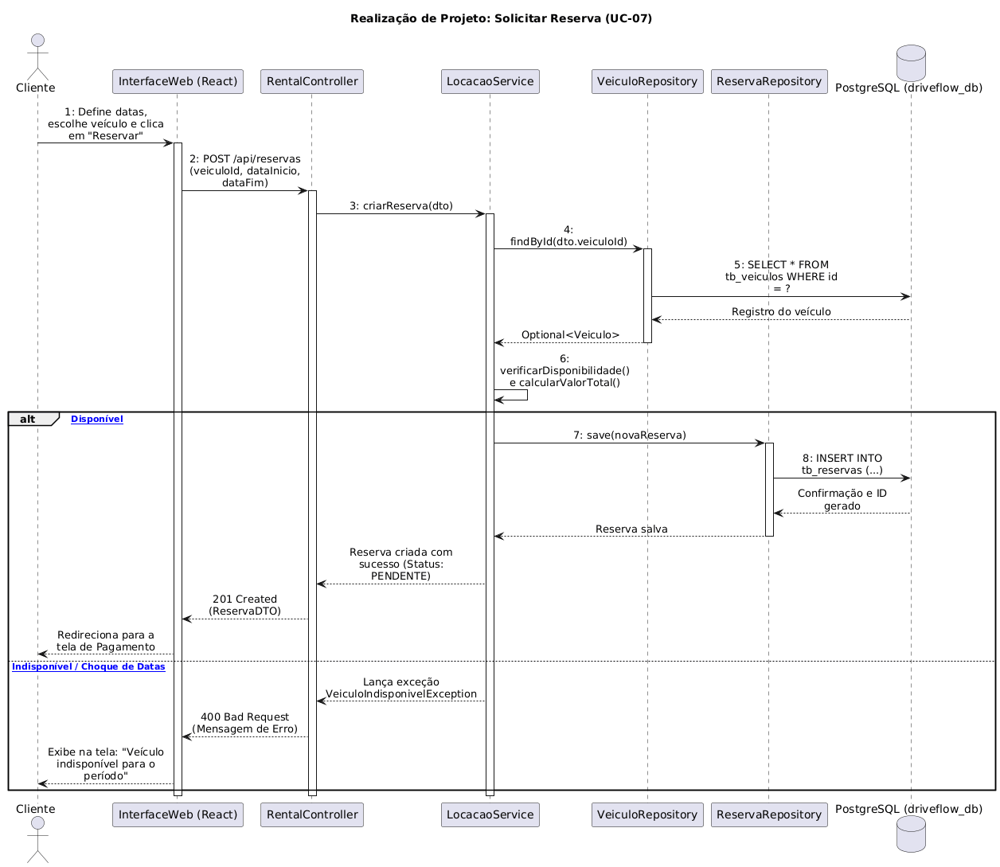
    </td>
  </tr>
  <tr>
    <td align="center" width="33%">
      <b>Comunicação</b><br>
      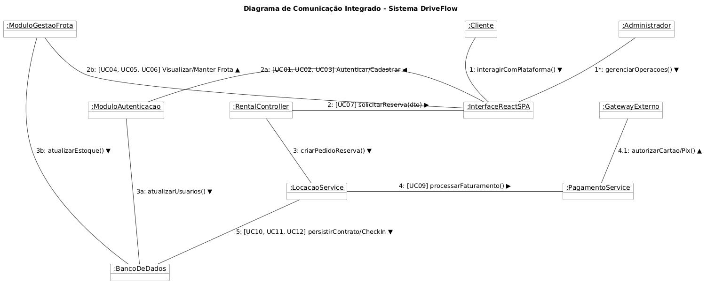
    </td>
    <td align="center" width="33%">
      <b>Estados</b><br>
      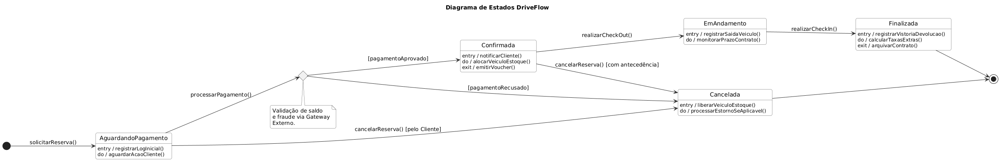
    </td>
    <td align="center" width="33%">
      <b>Dados (DER)</b><br>
      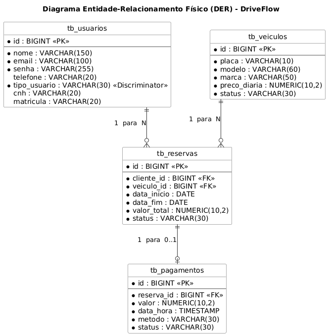
    </td>
  </tr>
</table>

---

## Histórico de Revisões

| Nome | Data | Razões para Mudança | Versão |
| --- | --- | --- | --- |
| João Pedro | 05/06/2026 | [cite_start]Criação da documentação estruturada do sistema DriveFlow [cite: 44] | 1.0 |
| João Pedro | 08/06/2026 | Refatoração estrutural anti-sobreposição e padronização monolítica | 1.1 |

---

## Scripts PlantUML

Todos os diagramas foram especificados em PlantUML. Os scripts estruturados encontram-se no diretório `CodigoPlantUml/` e as imagens renderizadas em `Diagramas/`.

| Modelo | Script PlantUML | Imagem |
| --- | --- | --- |
| Casos de uso | `CodigoPlantUml/CasoDeUso.puml` | `Diagramas/CasoDeUso.png` |
| Sequência do sistema (UC-07) | `CodigoPlantUml/SequenciaUC07.puml` | `Diagramas/SequenciaUC07.png` |
| Arquitetura | `CodigoPlantUml/Arquitetura.puml` | `Diagramas/Arquitetura.png` |
| Componentes | `CodigoPlantUml/Componentes.puml` | `Diagramas/Componentes.png` |
| Implantação | `CodigoPlantUml/Implantacao.puml` | `Diagramas/Implantacao.png` |
| Classes | `CodigoPlantUml/Classes.puml` | `Diagramas/Classes.png` |
| Sequência de projeto (Geral) | `CodigoPlantUml/Sequencia-Geral.puml` | `Diagramas/Sequencia-Geral.png` |
| Sequência de projeto (Core) | `CodigoPlantUml/Sequencia-Principal.puml` | `Diagramas/Sequencia-Principal.png` |
| Comunicação | `CodigoPlantUml/Comunicacao.puml` | `Diagramas/comunicacao.png` |
| Estados | `CodigoPlantUml/Estados.puml` | `Diagramas/estados.png` |
| Dados (DER) | `CodigoPlantUml/DER.puml` | `Diagramas/DER.png` |

---

# 1. Introdução

[cite_start]Este documento apresenta o projeto de engenharia de software do **DriveFlow**, uma plataforma moderna para controle operacional e reserva de veículos[cite: 53]. [cite_start]O sistema foi concebido sob uma **Arquitetura Monolítica Estruturada em 3 Camadas (3-Tier Architecture)**, integrando de forma síncrona a interface do usuário, a lógica de negócio e o armazenamento relacional de dados[cite: 204].

[cite_start]A interface com o usuário é implementada como uma *Single Page Application* (SPA) em **React**, comunicando-se através de requisições HTTPS e payload formato JSON REST com o servidor de aplicação back-end em **Java Spring Boot**[cite: 206, 207, 211, 212]. [cite_start]Toda a persistência de dados do domínio é centralizada de forma íntegra em uma instância isolada do sistema gerenciador relacional **PostgreSQL**[cite: 240].

## Objetivo do Sistema

Centralizar os processos operacionais de locação de veículos. [cite_start]O sistema gerencia de forma coesa a abertura de contas de clientes, a manutenção cadastral e situacional da frota automotiva, o ciclo transacional de reservas financeiras e os procedimentos analíticos de balcão (vistoria de check-out e check-in de devolução)[cite: 58, 60, 69, 77, 80, 81].

## Escopo

[cite_start]O projeto contempla a modelagem sistêmica completa da solução: delimitação de atores, detalhamento de requisitos funcionais e não funcionais, diagramas de arquitetura, mapeamento dinâmico de componentes, modelo de classes de domínio, interações de projeto via sequência e comunicação, máquinas de estado de negócio e modelagem física de dados via mapeamento objeto-relacional (ORM)[cite: 47].

## Tecnologias Propostas

| Camada | Tecnologias propostas |
| --- | --- |
| Front-end Web | [cite_start]React, HTML5, JavaScript (ES6+), CSS3 [cite: 207] |
| Back-end Engine | [cite_start]Java 17, Spring Boot Core, Spring Data JPA [cite: 250, 252, 235] |
| Servidor Embutido | [cite_start]Apache Tomcat [cite: 251] |
| Banco de Dados | [cite_start]SGBD Relacional PostgreSQL [cite: 240] |
| Driver de Conexão | [cite_start]JDBC / Hibernate ORM [cite: 239] |

## Regras de Negócio

| Código | Regra |
| --- | --- |
| RN-01 | [cite_start]O Cliente só pode solicitar reservas se possuir um registro de CNH válido cadastrado em seu perfil[cite: 58]. |
| RN-02 | [cite_start]Um veículo automotivo não pode receber reservas concorrentes em um mesmo intervalo de datas[cite: 77]. |
| RN-03 | O cadastro de um novo veículo exige a validação de unicidade da placa em relação à frota existente. |
| RN-04 | [cite_start]O valor total de uma locação é calculado multiplicando o número total de diárias do intervalo pelo valor unitário da diária do veículo[cite: 193]. |
| RN-05 | [cite_start]A liberação física do veículo (Check-out) está condicionada à existência de uma reserva com pagamento previamente aprovado[cite: 106]. |
| RN-06 | [cite_start]O veículo alterado para o estado de `MANUTENCAO` tem seu ID automaticamente bloqueado para consultas de novas locações[cite: 71]. |
| RN-07 | [cite_start]O procedimento de check-in (Devolução) deve computar a quilometragem rodada final para auditoria e controle de uso da frota[cite: 81]. |
| RN-08 | [cite_start]Taxas adicionais financeiras devem ser geradas caso haja atraso temporal na entrega ou divergência severa de combustível[cite: 199]. |

## Premissas e Restrições

- [cite_start]O sistema assume que a autenticação é gerada via emissão segura de Tokens JWT[cite: 66].
- [cite_start]O controle financeiro de pagamentos é delegado a um Gateway externo parceiro[cite: 61, 98].
- O DriveFlow encapsula identificadores transacionais, abstendo-se do armazenamento de cartões de crédito diretos.
- [cite_start]O veículo retorna para o status `DISPONIVEL` imediatamente após o fechamento sem avarias no check-in[cite: 199].

---

# 2. Modelos de Usuário e Requisitos

## 2.1 Descrição de Atores

| Ator | Descrição |
| --- | --- |
| **Cliente** | Usuário final do sistema. [cite_start]Realiza cadastro, consulta o catálogo de automóveis em tempo real, solicita reservas, realiza pagamentos e gerencia seu perfil[cite: 58]. |
| **Administrador** | Funcionário ou gerente da locadora. [cite_start]Responsável pelo controle operacional, incluindo cadastro da frota, bloqueio para manutenção, liberação (check-out) e recebimento (check-in) de veículos[cite: 60]. |
| **Gateway Pagamento** | [cite_start]Sistema externo parceiro encarregado do processamento e autorização segura das transações financeiras[cite: 61]. |

---

## 2.2 Modelo de Casos de Uso

[cite_start]O diagrama de casos de uso do ecossistema delimita as fronteiras da aplicação baseadas em três grandes contextos lógicos de negócio[cite: 83].

<p align="center">
  
</p>

| ID | Caso de Uso | Ator Principal | Descrição |
| --- | --- | --- | --- |
| **UC-01** | [cite_start]Autenticar Usuário [cite: 66] | [cite_start]Cliente / Administrador [cite: 66] | [cite_start]Permite que os usuários realizem login seguro utilizando credenciais e validação de tokens[cite: 66]. |
| **UC-02** | [cite_start]Cadastrar Cliente [cite: 67] | [cite_start]Cliente [cite: 86] | [cite_start]Permite que novos clientes criem contas informando dados pessoais, e-mail e CNH[cite: 67]. |
| **UC-03** | [cite_start]Gerenciar Perfil [cite: 68] | [cite_start]Cliente [cite: 86] | [cite_start]Permite ao cliente atualizar seus dados cadastrais, contatos e credenciais de acesso[cite: 68]. |
| **UC-04** | [cite_start]Manter Veículos (CRUD) [cite: 69] | [cite_start]Administrador [cite: 100] | [cite_start]Permite ao Administrador cadastrar, listar, atualizar e remover veículos da frota[cite: 69]. |
| **UC-05** | [cite_start]Consultar Catálogo [cite: 70] | [cite_start]Cliente [cite: 86] | [cite_start]Permite ao Cliente buscar carros disponíveis aplicando filtros por marca e modelo[cite: 70]. |
| **UC-06** | [cite_start]Registrar Manutenção [cite: 71] | [cite_start]Administrador [cite: 100] | [cite_start]Altera o estado de um carro para manutenção, bloqueando novas reservas no período[cite: 71]. |
| **UC-07** | [cite_start]Solicitar Reserva [cite: 77] | [cite_start]Cliente [cite: 86] | [cite_start]Fluxo principal onde o Cliente seleciona o carro, define as datas e abre uma reserva[cite: 77]. |
| **UC-08** | [cite_start]Cancelar Reserva [cite: 78] | [cite_start]Cliente / Administrador [cite: 86, 100] | [cite_start]Permite cancelar uma reserva ativa sob a aplicação de regras de negócio específicas[cite: 78]. |
| **UC-09** | [cite_start]Processar Pagamento [cite: 79] | [cite_start]Gateway Pagamento [cite: 98] | [cite_start]Integração para aprovação ou recusa da transação financeira vinculada à reserva[cite: 79]. |
| **UC-10** | [cite_start]Check-out (Retirada) [cite: 80] | [cite_start]Administrador [cite: 100] | [cite_start]Registra a entrega física e a chave do veículo ao cliente, ativando o contrato local[cite: 80]. |
| **UC-11** | [cite_start]Check-in (Devolução) [cite: 81] | [cite_start]Administrador [cite: 100] | [cite_start]Inspeção do carro no retorno, cálculo de quilometragem, avarias e encerramento[cite: 81]. |
| **UC-12** | [cite_start]Emitir Relatórios [cite: 82] | [cite_start]Administrador [cite: 100] | [cite_start]Extração de métricas operacionais consolidadas sobre faturamento e uso da frota[cite: 82]. |

---

## 2.3 Diagrama de Sequência do Sistema e Contratos de Operação

[cite_start]Os diagramas de sequência de sistema (DSS) tratam a aplicação de forma abstrata como uma **caixa preta**, mapeando os estímulos diretos gerados pelos atores na fronteira da aplicação[cite: 106].

### DSS: Solicitar Reserva de Veículo (UC-07)
<p align="center">
  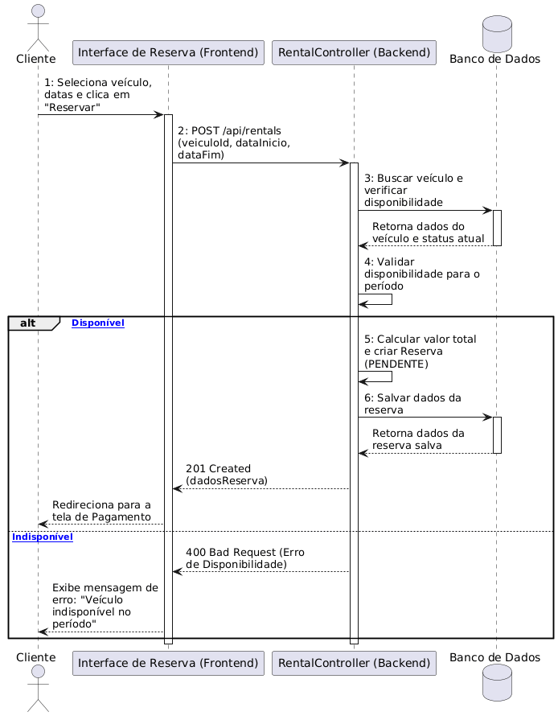
</p>

### Contratos de Operação (Análise Estrutural)

#### CO-01: Solicitação de Reserva de Automóvel
- [cite_start]**Operação:** `criarReserva(veiculoId, dataInicio, dataFim)` [cite: 193]
- [cite_start]**Referências Cruzadas:** UC-07: Solicitar Reserva de Veículo e UC-05: Consultar Catálogo de Veículos[cite: 193].
- [cite_start]**Pré-condições:** Cliente autenticado no ecossistema via JWT[cite: 193]. [cite_start]O `veiculoId` deve ser um registro ativo com status `DISPONIVEL` nas datas informadas[cite: 193].
- [cite_start]**Pós-condições:** Uma instância $r$ da classe `Reserva` foi criada e salva no banco de dados[cite: 193]. [cite_start]`r.clienteId` associado ao token, `r.dataInicio` e `r.dataFim` preenchidos com os parâmetros[cite: 193]. O `r.valorTotal` foi calculado multiplicando os dias pelo preço unitário obtido localmente via `VeiculoRepository`. [cite_start]O status inicial da reserva foi definido como `PENDENTE`[cite: 193].

#### CO-02: Cadastro de Veículo na Frota
- [cite_start]**Operação:** `cadastrarVeiculo(placa, modelo, marca, precoDiaria)` [cite: 194]
- [cite_start]**Referências Cruzadas:** UC-04: Manter Veículos (CRUD)[cite: 194].
- **Pré-condições:** Usuário autenticado sob a Role de `Administrador`. [cite_start]A `placa` enviada não pode existir previamente registrada no sistema[cite: 194].
- [cite_start]**Pós-condições:** Uma nova instância $v$ da classe `Veiculo` foi criada e persistida no banco[cite: 194]. [cite_start]`v.placa`, `v.modelo`, `v.marca` e `v.precoDiaria` foram devidamente inicializados[cite: 194]. [cite_start]O status interno de estoque de $v$ foi configurado por padrão como `DISPONIVEL`[cite: 194].

#### CO-03: Encerramento de Contrato e Check-in de Devolução
- [cite_start]**Operação:** `registrarCheckIn(reservaId, kmFinal, avarias, nivelCombustivel)` [cite: 199]
- [cite_start]**Referências Cruzadas:** UC-11: Realizar Check-in do Veículo (Devolução)[cite: 199].
- **Pré-condições:** Usuário autenticado como `Administrador`. [cite_start]A reserva identificada por `reservaId` deve conter o status operacional de `EM_ANDAMENTO`[cite: 199].
- [cite_start]**Pós-condições:** O status da reserva foi modificado para `FINALIZADA`[cite: 199]. [cite_start]O veículo associado teve seu status alterado para `DISPONIVEL` (ou para `MANUTENCAO`, caso o parâmetro de avarias registre danos estruturais severos)[cite: 199]. [cite_start]O sistema calculou taxas adicionais com base em quilometragem e combustível, atualizando o fechamento do registro de dados[cite: 199].

---

# 3. Modelos de Projeto

## 3.1 Arquitetura

[cite_start]O **DriveFlow** adota uma **Arquitetura Monolítica em 3 Camadas**[cite: 204]. [cite_start]Essa abordagem distribui de forma robusta e organizada as responsabilidades do sistema em componentes lógicos bem delimitados[cite: 204]:

1. [cite_start]**Frontend Client (Camada de Apresentação):** Uma *Single Page Application* (SPA) construída em React que roda no navegador do usuário, gerando interfaces altamente responsivas[cite: 205, 206, 207].
2. [cite_start]**Backend Server (Camada de Aplicação):** Desenvolvido em Java Spring Boot, é dividido de maneira modular em controladores HTTP REST, lógica abstrata de serviços de negócio e abstrações de repositórios[cite: 210, 211, 212, 213, 215, 216].
3. [cite_start]**Data Tier (Camada de Dados):** Onde as entidades estruturadas de domínio são armazenadas de maneira confiável em um SGBD relacional PostgreSQL[cite: 218, 219, 240].

<p align="center">
  
</p>

---

## 3.2 Diagrama de Componentes e Implantação

### Mapeamento de Componentes (Logical View)
[cite_start]O desacoplamento interno do código-fonte utiliza o padrão do Spring Data JPA, onde os controladores comunicam-se estritamente com as interfaces de regras de negócio, que por sua vez manipulam dados através das camadas de persistência[cite: 230, 235].

<p align="center">
  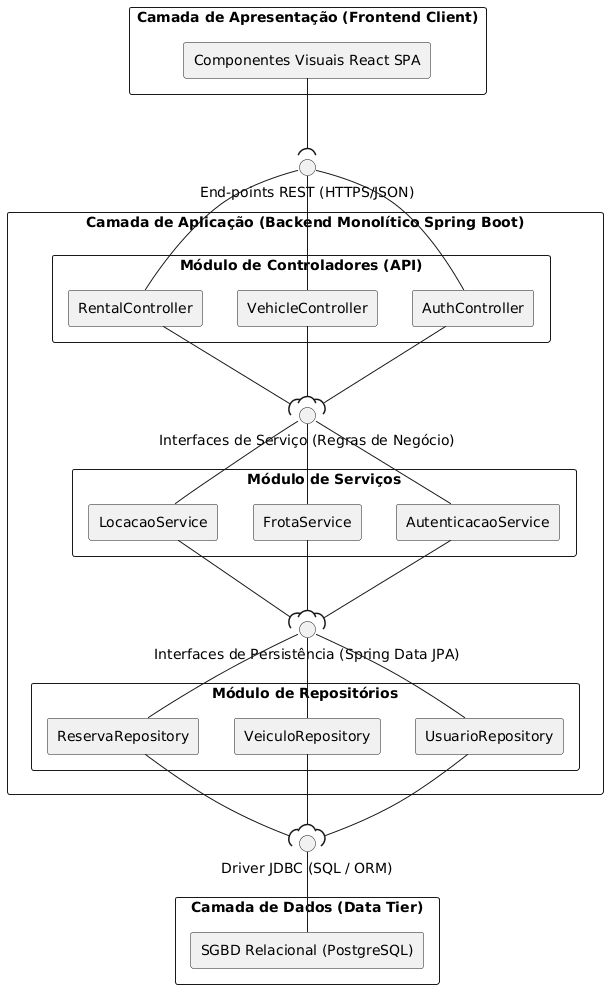
</p>

### Diagrama de Implantação (Physical View)
[cite_start]O mapeamento físico indica a topologia de rede cloud, demonstrando a distribuição dos artefatos estáticos web, o container de aplicação Tomcat executando o arquivo compiled `.jar` sob a JRE 17, e o banco PostgreSQL[cite: 246, 251, 252, 258].

<p align="center">
  
</p>

---

## 3.3 Diagrama de Classes

O diagrama de classes de domínio representa as entidades estruturais que serão espelhadas diretamente para o mapeamento objeto-relacional da base de dados, utilizando herança e associações bem definidas.

<p align="center">
  
</p>

---

## 3.4 Diagramas de Sequência de Projeto

[cite_start]Os diagramas de sequência de projeto mapeiam a realização interna dos fluxos operacionais da aplicação, evidenciando as ativações e chamadas síncronas entre os objetos de software[cite: 319].

### Visão Geral dos Fluxos de Projeto Unificados
[cite_start]O diagrama macro consolida os eixos lógicos de execução da API, dividindo as requisições HTTP enviadas pelo React pelas subcamadas de Controllers e Services da aplicação Java[cite: 322, 323, 324, 325].

<p align="center">
  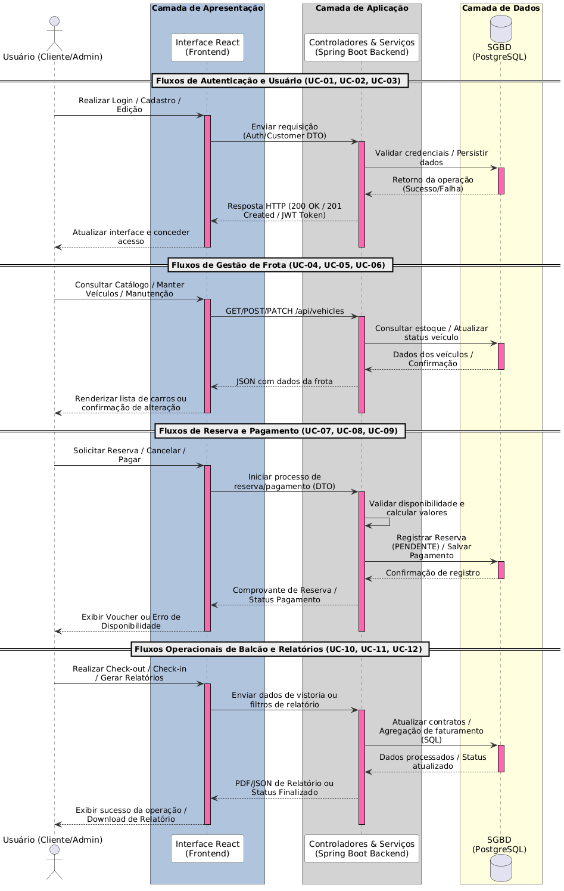
</p>

### Realização de Projeto Detalhada: Solicitar Reserva (UC-07)
Abaixo, demonstra-se a engenharia de software em execução profunda na subcamada da API, ilustrando a chamada síncrona do `RentalController` delegando regras de negócio ao `LocacaoService` e persistindo a entidade através do `ReservaRepository`.

<p align="center">
  
</p>

---

## 3.5 Diagramas de Comunicação

O diagrama de comunicação foca na organização estrutural integrada dos objetos que colaboram na arquitetura. Ele destaca o fluxo do core de locações e mapeia indiretamente os módulos satélites de autenticação e gestão de frota convergindo para o banco de dados unificado.

<p align="center">
  
</p>

---

## 3.6 Diagramas de Estados

A máquina de estados descreve as variações situacionais ocorridas no ciclo de vida de uma entidade **Reserva**, controlando suas transições a partir de gatilhos operacionais e condicionais de guarda.

<p align="center">
  
</p>

---

# 4. Modelos de Dados

[cite_start]O modelo de dados do DriveFlow utiliza mapeamento relacional estruturado, preservando integridade referencial nativa via chaves estrangeiras[cite: 404].

<p align="center">
  
</p>

## Estratégias de Mapeamento

- [cite_start]**Mapeamento de Herança (Single Table):** A hierarquia entre `Usuario`, `Cliente` e `Administrador` é persistida em uma única tabela chamada `tb_usuarios`[cite: 447]. [cite_start]O Hibernate gerencia a instanciação via coluna discriminadora `tipo_usuario`, otimizando a velocidade de resposta de JOINS na autenticação[cite: 447, 448].
- [cite_start]**Mapeamento de Associações (Foreign Keys):** As relações Muitos-para-Um (`@ManyToOne`) geram chaves físicas explicitadas em `tb_reservas` (`cliente_id` e `veiculo_id`)[cite: 449, 450, 452]. O vínculo exclusivo entre Reserva e Pagamento é resolvido via `@OneToOne` contendo delegação em cascata[cite: 453].
- [cite_start]**Mapeamento de Tipos Complexos (Enums):** Os estados e métodos transacionais de negócio são armazenados como strings textuais literais através da diretiva `@Enumerated(EnumType.STRING)`, garantindo facilidade em auditorias diretas via SQL[cite: 454, 455, 456].

---

## Estrutura do Repositório

```text
.
├── CodigoPlantUml
│   ├── Arquitetura.puml
│   ├── CasoDeUso.puml
│   ├── Classes.puml
│   ├── Componentes.puml
│   ├── Comunicacao.puml
│   ├── DER.puml
│   ├── Estados.puml
│   ├── Implantacao.puml
│   ├── Sequencia-Geral.puml
│   ├── Sequencia-Principal.puml
│   ├── SequenciaUC04.puml
│   └── SequenciaUC11.puml
├── Diagramas
│   ├── Arquitetura.png
│   ├── CasoDeUso.png
│   ├── Classes.png
│   ├── Componentes.png
│   ├── DER.png
│   ├── DriveFlow.pdf
│   ├── Implantacao.png
│   ├── Sequencia-Geral.png
│   ├── Sequencia-Principal.png
│   ├── SequenciaUC04.png
│   ├── SequenciaUC11.png
│   ├── com_comentarios_comunicacao.png
│   ├── com_comentarios_estados.png
│   ├── comunicacao.png
│   ├── estados.png
│   └── index.html
└── README.md
